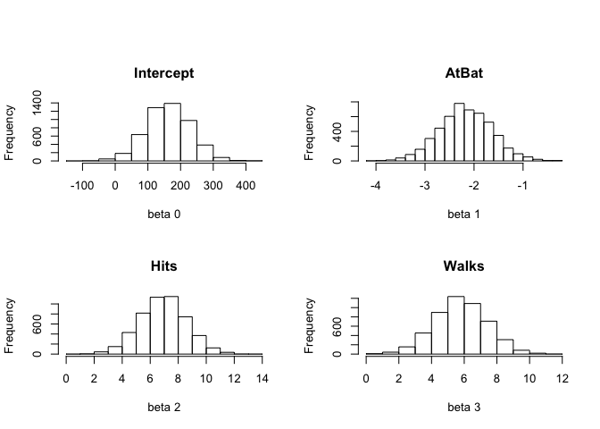
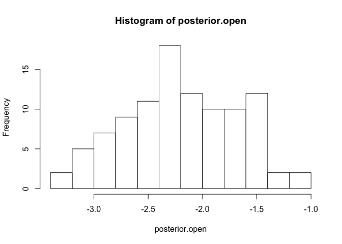
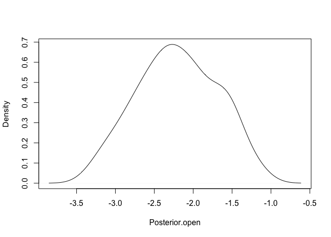
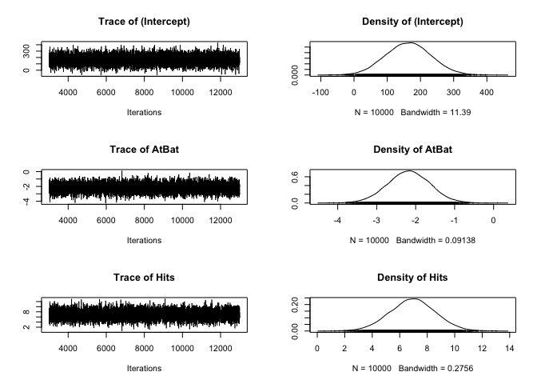
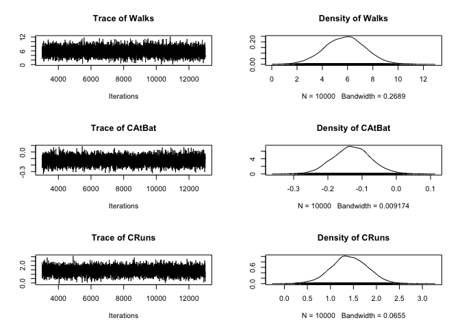
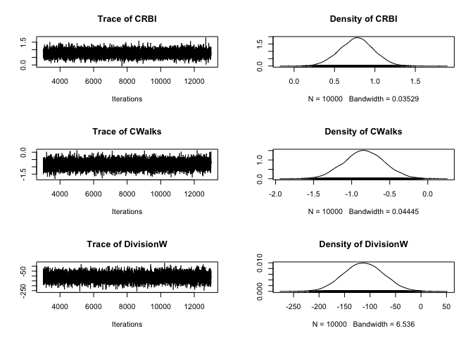
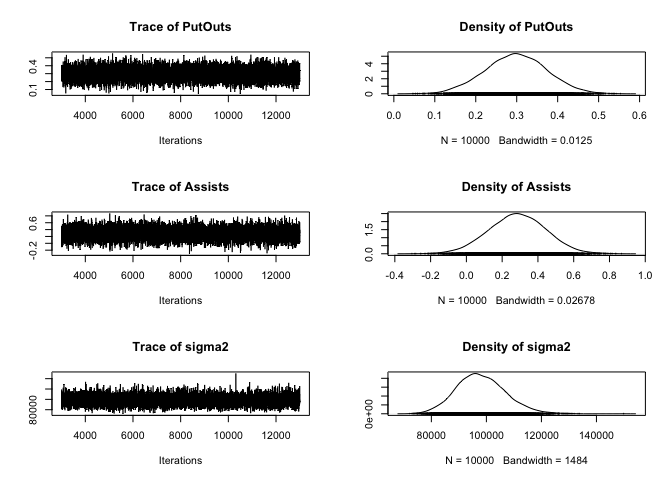

# Bayesian Generalized Linear Models in R
Sangyeol_lee  
Wednesday, April 08, 2015  
###Reference : http://www.unt.edu/rss/class/Jon/R_SC/

####Why not use MLE? : Overfitting
####Why not use MAP? : No representive of our uncertainty
####Why use Bayesian? : Optimize Loss Function

####Bayesian methods focus on five essential elements.

####'First', the incorporation of prior information (e.g.,expert opinion, a thorough literature review of the same or similar variables, and/or prior data). Prior information is generally specified quantitatively in the form of a distribution (e.g., normal/Gaussian, Poisson, binomial, etc.) 

####'Second', the prior is combined with a likelihood function. The likelihood function represents the data Second, the prior is combined with a likelihood function. 

####'Third', the combination of the prior with the likelihood function results in the creation of a posterior distribution of coefficient values.

####'Fourth', simulates are drawn from the posterior distribution to create an empirical distribution of likely values for the population parameter.

####'Fifth', basic statistics are used to summarize the empirical distribution of simulates from the posterior


```r
#traditional Ordinary Least Squares (OLS) regression, stepwise regression
library(ISLR)
```

```
## Warning: package 'ISLR' was built under R version 3.1.2
```

```r
data(Hitters)
head(Hitters)
```

```
##                   AtBat Hits HmRun Runs RBI Walks Years CAtBat CHits
## -Andy Allanson      293   66     1   30  29    14     1    293    66
## -Alan Ashby         315   81     7   24  38    39    14   3449   835
## -Alvin Davis        479  130    18   66  72    76     3   1624   457
## -Andre Dawson       496  141    20   65  78    37    11   5628  1575
## -Andres Galarraga   321   87    10   39  42    30     2    396   101
## -Alfredo Griffin    594  169     4   74  51    35    11   4408  1133
##                   CHmRun CRuns CRBI CWalks League Division PutOuts Assists
## -Andy Allanson         1    30   29     14      A        E     446      33
## -Alan Ashby           69   321  414    375      N        W     632      43
## -Alvin Davis          63   224  266    263      A        W     880      82
## -Andre Dawson        225   828  838    354      N        E     200      11
## -Andres Galarraga     12    48   46     33      N        E     805      40
## -Alfredo Griffin      19   501  336    194      A        W     282     421
##                   Errors Salary NewLeague
## -Andy Allanson        20     NA         A
## -Alan Ashby           10  475.0         N
## -Alvin Davis          14  480.0         A
## -Andre Dawson          3  500.0         N
## -Andres Galarraga      4   91.5         N
## -Alfredo Griffin      25  750.0         A
```

```r
Hitters=na.omit(Hitters)
model.1 <- step(lm(Salary ~ ., data = Hitters, x = TRUE, y = TRUE),direction="backward")
```

```
## Start:  AIC=3046.02
## Salary ~ AtBat + Hits + HmRun + Runs + RBI + Walks + Years + 
##     CAtBat + CHits + CHmRun + CRuns + CRBI + CWalks + League + 
##     Division + PutOuts + Assists + Errors + NewLeague
## 
##             Df Sum of Sq      RSS    AIC
## - CHmRun     1      1138 24201837 3044.0
## - CHits      1      3930 24204629 3044.1
## - Years      1      7869 24208569 3044.1
## - NewLeague  1      9784 24210484 3044.1
## - RBI        1     16076 24216776 3044.2
## - HmRun      1     48572 24249272 3044.6
## - Errors     1     58324 24259023 3044.7
## - League     1     62121 24262821 3044.7
## - Runs       1     63291 24263990 3044.7
## - CRBI       1    135439 24336138 3045.5
## - CAtBat     1    159864 24360564 3045.8
## <none>                   24200700 3046.0
## - Assists    1    280263 24480963 3047.1
## - CRuns      1    374007 24574707 3048.1
## - CWalks     1    609408 24810108 3050.6
## - Division   1    834491 25035190 3052.9
## - AtBat      1    971288 25171987 3054.4
## - Hits       1    991242 25191941 3054.6
## - Walks      1   1156606 25357305 3056.3
## - PutOuts    1   1319628 25520328 3058.0
## 
## Step:  AIC=3044.03
## Salary ~ AtBat + Hits + HmRun + Runs + RBI + Walks + Years + 
##     CAtBat + CHits + CRuns + CRBI + CWalks + League + Division + 
##     PutOuts + Assists + Errors + NewLeague
## 
##             Df Sum of Sq      RSS    AIC
## - Years      1      7609 24209447 3042.1
## - NewLeague  1     10268 24212106 3042.2
## - CHits      1     14003 24215840 3042.2
## - RBI        1     14955 24216793 3042.2
## - HmRun      1     52777 24254614 3042.6
## - Errors     1     59530 24261367 3042.7
## - League     1     63407 24265244 3042.7
## - Runs       1     64860 24266698 3042.7
## - CAtBat     1    174992 24376830 3043.9
## <none>                   24201837 3044.0
## - Assists    1    285766 24487603 3045.1
## - CRuns      1    611358 24813196 3048.6
## - CWalks     1    645627 24847464 3049.0
## - Division   1    834637 25036474 3050.9
## - CRBI       1    864220 25066057 3051.3
## - AtBat      1    970861 25172699 3052.4
## - Hits       1   1025981 25227819 3052.9
## - Walks      1   1167378 25369216 3054.4
## - PutOuts    1   1325273 25527110 3056.1
## 
## Step:  AIC=3042.12
## Salary ~ AtBat + Hits + HmRun + Runs + RBI + Walks + CAtBat + 
##     CHits + CRuns + CRBI + CWalks + League + Division + PutOuts + 
##     Assists + Errors + NewLeague
## 
##             Df Sum of Sq      RSS    AIC
## - NewLeague  1      9931 24219377 3040.2
## - RBI        1     15989 24225436 3040.3
## - CHits      1     18291 24227738 3040.3
## - HmRun      1     54144 24263591 3040.7
## - Errors     1     57312 24266759 3040.7
## - Runs       1     63172 24272619 3040.8
## - League     1     65732 24275178 3040.8
## <none>                   24209447 3042.1
## - CAtBat     1    266205 24475652 3043.0
## - Assists    1    293479 24502926 3043.3
## - CRuns      1    646350 24855797 3047.1
## - CWalks     1    649269 24858716 3047.1
## - Division   1    827511 25036958 3049.0
## - CRBI       1    872121 25081568 3049.4
## - AtBat      1    968713 25178160 3050.4
## - Hits       1   1018379 25227825 3050.9
## - Walks      1   1164536 25373983 3052.5
## - PutOuts    1   1334525 25543972 3054.2
## 
## Step:  AIC=3040.22
## Salary ~ AtBat + Hits + HmRun + Runs + RBI + Walks + CAtBat + 
##     CHits + CRuns + CRBI + CWalks + League + Division + PutOuts + 
##     Assists + Errors
## 
##            Df Sum of Sq      RSS    AIC
## - RBI       1     15800 24235177 3038.4
## - CHits     1     15859 24235237 3038.4
## - Errors    1     54505 24273883 3038.8
## - HmRun     1     54938 24274316 3038.8
## - Runs      1     62294 24281671 3038.9
## - League    1    107479 24326856 3039.4
## <none>                  24219377 3040.2
## - CAtBat    1    261336 24480713 3041.1
## - Assists   1    295536 24514914 3041.4
## - CWalks    1    648860 24868237 3045.2
## - CRuns     1    661449 24880826 3045.3
## - Division  1    824672 25044049 3047.0
## - CRBI      1    880429 25099806 3047.6
## - AtBat     1    999057 25218434 3048.9
## - Hits      1   1034463 25253840 3049.2
## - Walks     1   1157205 25376583 3050.5
## - PutOuts   1   1335173 25554550 3052.3
## 
## Step:  AIC=3038.4
## Salary ~ AtBat + Hits + HmRun + Runs + Walks + CAtBat + CHits + 
##     CRuns + CRBI + CWalks + League + Division + PutOuts + Assists + 
##     Errors
## 
##            Df Sum of Sq      RSS    AIC
## - CHits     1     13483 24248660 3036.5
## - HmRun     1     44586 24279763 3036.9
## - Runs      1     54057 24289234 3037.0
## - Errors    1     57656 24292833 3037.0
## - League    1    108644 24343821 3037.6
## <none>                  24235177 3038.4
## - CAtBat    1    252756 24487934 3039.1
## - Assists   1    294674 24529851 3039.6
## - CWalks    1    639690 24874868 3043.2
## - CRuns     1    693535 24928712 3043.8
## - Division  1    808984 25044161 3045.0
## - CRBI      1    893830 25129008 3045.9
## - Hits      1   1034884 25270061 3047.4
## - AtBat     1   1042798 25277975 3047.5
## - Walks     1   1145013 25380191 3048.5
## - PutOuts   1   1340713 25575890 3050.6
## 
## Step:  AIC=3036.54
## Salary ~ AtBat + Hits + HmRun + Runs + Walks + CAtBat + CRuns + 
##     CRBI + CWalks + League + Division + PutOuts + Assists + Errors
## 
##            Df Sum of Sq      RSS    AIC
## - HmRun     1     40487 24289148 3035.0
## - Errors    1     51930 24300590 3035.1
## - Runs      1     79343 24328003 3035.4
## - League    1    114742 24363402 3035.8
## <none>                  24248660 3036.5
## - Assists   1    283442 24532103 3037.6
## - CAtBat    1    613356 24862016 3041.1
## - Division  1    801474 25050134 3043.1
## - CRBI      1    903248 25151908 3044.2
## - CWalks    1   1011953 25260613 3045.3
## - Walks     1   1246164 25494824 3047.7
## - AtBat     1   1339620 25588280 3048.7
## - CRuns     1   1390808 25639469 3049.2
## - PutOuts   1   1406023 25654684 3049.4
## - Hits      1   1607990 25856650 3051.4
## 
## Step:  AIC=3034.98
## Salary ~ AtBat + Hits + Runs + Walks + CAtBat + CRuns + CRBI + 
##     CWalks + League + Division + PutOuts + Assists + Errors
## 
##            Df Sum of Sq      RSS    AIC
## - Errors    1     44085 24333232 3033.5
## - Runs      1     49068 24338215 3033.5
## - League    1    103837 24392985 3034.1
## <none>                  24289148 3035.0
## - Assists   1    247002 24536150 3035.6
## - CAtBat    1    652746 24941894 3040.0
## - Division  1    795643 25084791 3041.5
## - CWalks    1    982896 25272044 3043.4
## - Walks     1   1205823 25494971 3045.7
## - AtBat     1   1300972 25590120 3046.7
## - CRuns     1   1351200 25640348 3047.2
## - CRBI      1   1353507 25642655 3047.2
## - PutOuts   1   1429006 25718154 3048.0
## - Hits      1   1574140 25863288 3049.5
## 
## Step:  AIC=3033.46
## Salary ~ AtBat + Hits + Runs + Walks + CAtBat + CRuns + CRBI + 
##     CWalks + League + Division + PutOuts + Assists
## 
##            Df Sum of Sq      RSS    AIC
## - Runs      1     54113 24387345 3032.0
## - League    1     91269 24424501 3032.4
## <none>                  24333232 3033.5
## - Assists   1    220010 24553242 3033.8
## - CAtBat    1    650513 24983746 3038.4
## - Division  1    799455 25132687 3040.0
## - CWalks    1    971260 25304493 3041.8
## - Walks     1   1239533 25572765 3044.5
## - CRBI      1   1331672 25664904 3045.5
## - CRuns     1   1361070 25694302 3045.8
## - AtBat     1   1378592 25711824 3045.9
## - PutOuts   1   1391660 25724892 3046.1
## - Hits      1   1649291 25982523 3048.7
## 
## Step:  AIC=3032.04
## Salary ~ AtBat + Hits + Walks + CAtBat + CRuns + CRBI + CWalks + 
##     League + Division + PutOuts + Assists
## 
##            Df Sum of Sq      RSS    AIC
## - League    1    113056 24500402 3031.3
## <none>                  24387345 3032.0
## - Assists   1    280689 24668034 3033.1
## - CAtBat    1    596622 24983967 3036.4
## - Division  1    780369 25167714 3038.3
## - CWalks    1    946687 25334032 3040.1
## - Walks     1   1212997 25600342 3042.8
## - CRuns     1   1334397 25721742 3044.1
## - CRBI      1   1361339 25748684 3044.3
## - PutOuts   1   1455210 25842555 3045.3
## - AtBat     1   1522760 25910105 3046.0
## - Hits      1   1718870 26106215 3047.9
## 
## Step:  AIC=3031.26
## Salary ~ AtBat + Hits + Walks + CAtBat + CRuns + CRBI + CWalks + 
##     Division + PutOuts + Assists
## 
##            Df Sum of Sq      RSS    AIC
## <none>                  24500402 3031.3
## - Assists   1    313650 24814051 3032.6
## - CAtBat    1    534156 25034558 3034.9
## - Division  1    798473 25298875 3037.7
## - CWalks    1    965875 25466276 3039.4
## - CRuns     1   1265082 25765484 3042.5
## - Walks     1   1290168 25790569 3042.8
## - CRBI      1   1326770 25827172 3043.1
## - PutOuts   1   1551523 26051925 3045.4
## - AtBat     1   1589780 26090181 3045.8
## - Hits      1   1716068 26216469 3047.1
```

```r
summary(model.1)
```

```
## 
## Call:
## lm(formula = Salary ~ AtBat + Hits + Walks + CAtBat + CRuns + 
##     CRBI + CWalks + Division + PutOuts + Assists, data = Hitters, 
##     x = TRUE, y = TRUE)
## 
## Residuals:
##     Min      1Q  Median      3Q     Max 
## -939.11 -176.87  -34.08  130.90 1910.55 
## 
## Coefficients:
##               Estimate Std. Error t value Pr(>|t|)    
## (Intercept)  162.53544   66.90784   2.429 0.015830 *  
## AtBat         -2.16865    0.53630  -4.044 7.00e-05 ***
## Hits           6.91802    1.64665   4.201 3.69e-05 ***
## Walks          5.77322    1.58483   3.643 0.000327 ***
## CAtBat        -0.13008    0.05550  -2.344 0.019858 *  
## CRuns          1.40825    0.39040   3.607 0.000373 ***
## CRBI           0.77431    0.20961   3.694 0.000271 ***
## CWalks        -0.83083    0.26359  -3.152 0.001818 ** 
## DivisionW   -112.38006   39.21438  -2.866 0.004511 ** 
## PutOuts        0.29737    0.07444   3.995 8.50e-05 ***
## Assists        0.28317    0.15766   1.796 0.073673 .  
## ---
## Signif. codes:  0 '***' 0.001 '**' 0.01 '*' 0.05 '.' 0.1 ' ' 1
## 
## Residual standard error: 311.8 on 252 degrees of freedom
## Multiple R-squared:  0.5405,	Adjusted R-squared:  0.5223 
## F-statistic: 29.64 on 10 and 252 DF,  p-value: < 2.2e-16
```

```r
confint(model.1)
```

```
##                     2.5 %       97.5 %
## (Intercept)   30.76564039 294.30524369
## AtBat         -3.22485010  -1.11245000
## Hits           3.67507200  10.16096299
## Walks          2.65203223   8.89441706
## CAtBat        -0.23937493  -0.02078463
## CRuns          0.63939259   2.17710543
## CRBI           0.36150857   1.18711573
## CWalks        -1.34995509  -0.31169761
## DivisionW   -189.60973671 -35.15037828
## PutOuts        0.15076820   0.44397699
## Assists       -0.02732144   0.59365750
```

```r
#But what does this really tell us?
```


```r
#
library(LearnBayes)
```

```
## Warning: package 'LearnBayes' was built under R version 3.1.2
```

```r
#Gives a simulated sample from the joint posterior distribution of the regression vector and the error standard deviation for a linear regression model with a noninformative
joint.posterior.samples <- blinreg(model.1$y, model.1$x, 5000)
oldpar <- par(oma=c(0,0,3,0), mfrow=c(2,2))
hist(joint.posterior.samples$beta[,1], main = "Intercept", xlab = "beta 0")
hist(joint.posterior.samples$beta[,2], main = "AtBat", xlab = "beta 1")
hist(joint.posterior.samples$beta[,3], main = "Hits", xlab = "beta 2")
hist(joint.posterior.samples$beta[,4], main = "Walks", xlab = "beta 3")
```

 

```r
par(oldpar)
```


```r
# To display the 95% credible intervals[Bayesian confidence interval:a posterior probability distribution used for interval estimation] (and medians) from the distributions, use an 'apply' function. 
apply(joint.posterior.samples$beta, 2, quantile, c(.025, .500, .975))
```

```
##       X(Intercept)    XAtBat     XHits   XWalks     XCAtBat    XCRuns
## 2.5%      28.76785 -3.236407  3.608064 2.607493 -0.23725174 0.6251287
## 50%      161.27018 -2.184659  6.949457 5.780419 -0.13173403 1.4100760
## 97.5%    292.03988 -1.098075 10.209252 8.886494 -0.01961774 2.2020981
##           XCRBI    XCWalks XDivisionW  XPutOuts    XAssists
## 2.5%  0.3604256 -1.3642696 -189.17936 0.1542088 -0.02701138
## 50%   0.7779286 -0.8313523 -112.29701 0.2976190  0.28687689
## 97.5% 1.1929659 -0.3216264  -33.07594 0.4476204  0.58842072
```


```r
library(arm)
```

```
## Warning: package 'arm' was built under R version 3.1.3
```

```
## Loading required package: MASS
```

```
## Warning: package 'MASS' was built under R version 3.1.2
```

```
## Loading required package: Matrix
```

```
## Warning: package 'Matrix' was built under R version 3.1.2
```

```
## Loading required package: lme4
```

```
## Warning: package 'lme4' was built under R version 3.1.2
```

```
## Loading required package: Rcpp
```

```
## Warning: package 'Rcpp' was built under R version 3.1.3
```

```
## 
## arm (Version 1.8-4, built: 2015-04-07)
## 
## Working directory is /Users/moodern/Google 드라이브/베이지안통계/part1/R/bayesianregression
```

```r
# Conduct the Bayesian Generalized linear model (here family = Gaussian, as is default).
model.2 <- bayesglm(Salary~AtBat+Hits+Walks+CAtBat+CRuns+CRBI+CWalks+Division+PutOuts+Assists, family = "gaussian", data = Hitters, prior.scale=Inf, prior.df=Inf)
summary(model.2)
```

```
## 
## Call:
## bayesglm(formula = Salary ~ AtBat + Hits + Walks + CAtBat + CRuns + 
##     CRBI + CWalks + Division + PutOuts + Assists, family = "gaussian", 
##     data = Hitters, prior.scale = Inf, prior.df = Inf)
## 
## Deviance Residuals: 
##     Min       1Q   Median       3Q      Max  
## -939.11  -176.87   -34.08   130.91  1910.55  
## 
## Coefficients:
##               Estimate Std. Error t value Pr(>|t|)    
## (Intercept)  162.53058   66.90782   2.429 0.015833 *  
## AtBat         -2.16865    0.53630  -4.044 7.00e-05 ***
## Hits           6.91802    1.64665   4.201 3.69e-05 ***
## Walks          5.77322    1.58483   3.643 0.000327 ***
## CAtBat        -0.13008    0.05550  -2.344 0.019858 *  
## CRuns          1.40825    0.39040   3.607 0.000373 ***
## CRBI           0.77431    0.20961   3.694 0.000271 ***
## CWalks        -0.83083    0.26359  -3.152 0.001818 ** 
## DivisionW   -112.38006   39.21438  -2.866 0.004511 ** 
## PutOuts        0.29737    0.07444   3.995 8.50e-05 ***
## Assists        0.28317    0.15766   1.796 0.073673 .  
## ---
## Signif. codes:  0 '***' 0.001 '**' 0.01 '*' 0.05 '.' 0.1 ' ' 1
## 
## (Dispersion parameter for gaussian family taken to be 97223.82)
## 
##     Null deviance: 53319113  on 262  degrees of freedom
## Residual deviance: 24500402  on 252  degrees of freedom
## AIC: 3779.6
## 
## Number of Fisher Scoring iterations: 7
```


```r
simulates <- coef(sim(model.2))
head(simulates)
```

```
##      (Intercept)     AtBat     Hits    Walks      CAtBat     CRuns
## [1,]    245.9365 -2.564983 8.406301 6.018244 -0.24366964 1.9861266
## [2,]    188.7658 -1.515596 5.963264 2.648046 -0.07708377 0.6727034
## [3,]    119.9218 -2.021112 7.147965 4.939572 -0.14827582 2.1962228
## [4,]    157.3588 -2.249339 6.244926 7.303011 -0.06406493 1.0822331
## [5,]    196.0815 -2.519319 7.709565 6.215528 -0.09313694 1.4661667
## [6,]    221.3343 -2.291642 7.244021 4.692335 -0.15535993 1.2913480
##           CRBI     CWalks DivisionW   PutOuts      Assists
## [1,] 1.2601220 -1.2663429 -171.8177 0.3053617 0.2984496540
## [2,] 0.9139821 -0.5559680 -191.2886 0.3095893 0.1591645637
## [3,] 0.2485923 -0.9565678 -148.0399 0.3211596 0.0005705172
## [4,] 0.9285909 -1.0882823 -114.2606 0.2530632 0.3171362772
## [5,] 0.7367792 -1.2145861 -191.4720 0.4424243 0.3083065025
## [6,] 0.8667205 -0.4926049 -145.2815 0.3220155 0.5428532727
```

```r
posterior.open <- simulates[,2]
head(posterior.open)
```

```
## [1] -2.564983 -1.515596 -2.021112 -2.249339 -2.519319 -2.291642
```

```r
par(mfrow=c(1,1))
hist(posterior.open)
```

 

```r
plot(density(posterior.open), main = "", xlab = "Posterior.open", ylab = "Density")
```

 

```r
# Retrieve the 95% credible interval for the open variable's coefficient.
quantile(posterior.open, c(.025, .975))
```

```
##      2.5%     97.5% 
## -3.139237 -1.306707
```


```r
library(MCMCpack)
```

```
## Warning: package 'MCMCpack' was built under R version 3.1.2
```

```
## Loading required package: coda
```

```
## Warning: package 'coda' was built under R version 3.1.3
```

```
## 
## Attaching package: 'coda'
## 
## The following object is masked from 'package:arm':
## 
##     traceplot
## 
## ##
## ## Markov Chain Monte Carlo Package (MCMCpack)
## ## Copyright (C) 2003-2015 Andrew D. Martin, Kevin M. Quinn, and Jong Hee Park
## ##
## ## Support provided by the U.S. National Science Foundation
## ## (Grants SES-0350646 and SES-0350613)
## ##
## 
## Attaching package: 'MCMCpack'
## 
## The following object is masked from 'package:LearnBayes':
## 
##     rdirichlet
```

```r
model.3 <- MCMCregress(Salary~AtBat+Hits+Walks+CAtBat+CRuns+CRBI+CWalks+Division+PutOuts+Assists, data = Hitters, burnin = 3000, mcmc = 10000, verbose = 1000, seed = NA, beta.start = NA)
```

```
## 
## 
## MCMCregress iteration 1 of 13000 
## beta = 
##  257.80280
##   -2.15326
##    6.72180
##    4.89756
##   -0.20469
##    1.59195
##    0.92860
##   -0.54330
## -109.88147
##    0.29914
##    0.15717
## sigma2 = 98250.91761
## 
## 
## MCMCregress iteration 1001 of 13000 
## beta = 
##  227.84376
##   -2.86991
##    8.68673
##    6.48707
##   -0.16508
##    1.86055
##    0.75150
##   -1.09328
## -131.84219
##    0.30023
##    0.42341
## sigma2 = 105370.41062
## 
## 
## MCMCregress iteration 2001 of 13000 
## beta = 
##  170.70258
##   -1.58901
##    5.95458
##    3.42729
##   -0.16681
##    1.26187
##    0.81976
##   -0.43564
##  -56.47505
##    0.27070
##    0.08646
## sigma2 = 93211.05921
## 
## 
## MCMCregress iteration 3001 of 13000 
## beta = 
##   91.53963
##   -1.05203
##    3.34177
##    5.24995
##   -0.22319
##    2.16926
##    0.81533
##   -1.03503
##  -30.24605
##    0.30729
##    0.30309
## sigma2 = 116917.77875
## 
## 
## MCMCregress iteration 4001 of 13000 
## beta = 
##  187.03759
##   -2.70954
##    9.10087
##    5.38630
##   -0.17708
##    1.66874
##    0.68773
##   -0.62454
##  -96.54137
##    0.25939
##    0.08316
## sigma2 = 76510.77109
## 
## 
## MCMCregress iteration 5001 of 13000 
## beta = 
##  200.90334
##   -2.68242
##    7.70420
##    6.58449
##   -0.13567
##    1.68241
##    0.72978
##   -0.97267
##  -95.74549
##    0.35683
##    0.33232
## sigma2 = 85954.26307
## 
## 
## MCMCregress iteration 6001 of 13000 
## beta = 
##  182.54547
##   -2.71216
##    8.32391
##    6.39576
##   -0.14158
##    1.68089
##    0.44301
##   -0.59778
## -119.13613
##    0.40282
##   -0.02833
## sigma2 = 87004.65096
## 
## 
## MCMCregress iteration 7001 of 13000 
## beta = 
##  227.88812
##   -2.02647
##    5.12662
##    8.00250
##   -0.18917
##    1.91685
##    1.06716
##   -1.27613
##  -94.87868
##    0.28557
##    0.40533
## sigma2 = 89519.89504
## 
## 
## MCMCregress iteration 8001 of 13000 
## beta = 
##  195.50564
##   -2.95633
##    8.86822
##    8.51649
##   -0.11171
##    1.03846
##    0.66465
##   -0.34423
## -115.99559
##    0.23310
##    0.26118
## sigma2 = 108311.15708
## 
## 
## MCMCregress iteration 9001 of 13000 
## beta = 
##  181.43587
##   -1.95807
##    6.44895
##    5.02445
##   -0.12647
##    1.41957
##    0.89163
##   -0.95369
## -107.23072
##    0.23844
##    0.22974
## sigma2 = 85083.55117
## 
## 
## MCMCregress iteration 10001 of 13000 
## beta = 
##  144.65261
##   -1.88796
##    5.93995
##    7.85979
##   -0.17399
##    1.71799
##    0.85562
##   -0.93492
## -162.87604
##    0.27071
##    0.09325
## sigma2 = 99865.68958
## 
## 
## MCMCregress iteration 11001 of 13000 
## beta = 
##   11.69946
##   -1.22992
##    3.79550
##    7.50951
##   -0.08459
##    1.27727
##    0.80287
##   -1.08464
## -119.93612
##    0.40165
##    0.19863
## sigma2 = 92937.41009
## 
## 
## MCMCregress iteration 12001 of 13000 
## beta = 
##  235.66299
##   -2.62503
##    8.51615
##    4.92052
##   -0.11200
##    1.07168
##    0.71490
##   -0.45159
## -124.84402
##    0.26825
##    0.34124
## sigma2 = 91372.95941
```

```r
summary(model.3)
```

```
## 
## Iterations = 3001:13000
## Thinning interval = 1 
## Number of chains = 1 
## Sample size per chain = 10000 
## 
## 1. Empirical mean and standard deviation for each variable,
##    plus standard error of the mean:
## 
##                   Mean        SD  Naive SE Time-series SE
## (Intercept)   163.5554 6.781e+01 6.781e-01      6.781e-01
## AtBat          -2.1803 5.439e-01 5.439e-03      5.439e-03
## Hits            6.9395 1.655e+00 1.655e-02      1.655e-02
## Walks           5.7946 1.600e+00 1.600e-02      1.559e-02
## CAtBat         -0.1301 5.550e-02 5.550e-04      5.550e-04
## CRuns           1.4119 3.915e-01 3.915e-03      3.985e-03
## CRBI            0.7739 2.106e-01 2.106e-03      2.106e-03
## CWalks         -0.8347 2.647e-01 2.647e-03      2.647e-03
## DivisionW    -112.5032 3.890e+01 3.890e-01      3.890e-01
## PutOuts         0.2980 7.443e-02 7.443e-04      7.342e-04
## Assists         0.2848 1.594e-01 1.594e-03      1.567e-03
## sigma2      98054.3746 8.868e+03 8.868e+01      9.302e+01
## 
## 2. Quantiles for each variable:
## 
##                   2.5%        25%        50%        75%      97.5%
## (Intercept)  3.148e+01   117.5466   163.8727  2.092e+02  2.964e+02
## AtBat       -3.263e+00    -2.5411    -2.1748 -1.810e+00 -1.109e+00
## Hits         3.668e+00     5.8411     6.9523  8.039e+00  1.018e+01
## Walks        2.647e+00     4.7077     5.8131  6.860e+00  8.937e+00
## CAtBat      -2.381e-01    -0.1670    -0.1303 -9.382e-02 -1.966e-02
## CRuns        6.348e-01     1.1560     1.4076  1.678e+00  2.168e+00
## CRBI         3.610e-01     0.6321     0.7752  9.136e-01  1.182e+00
## CWalks      -1.347e+00    -1.0120    -0.8364 -6.574e-01 -3.169e-01
## DivisionW   -1.877e+02  -138.8548  -112.6978 -8.599e+01 -3.653e+01
## PutOuts      1.511e-01     0.2481     0.2983  3.487e-01  4.435e-01
## Assists     -3.096e-02     0.1777     0.2854  3.930e-01  5.929e-01
## sigma2       8.177e+04 91844.4297 97528.6826  1.037e+05  1.167e+05
```

```r
plot(model.3)
```

    
